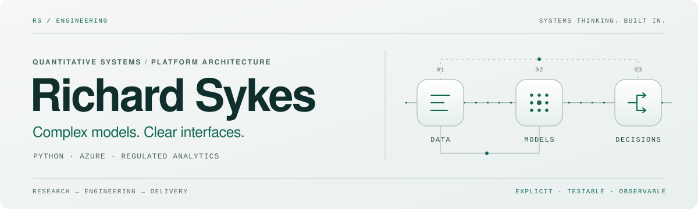

<picture>
  <source media="(max-width: 600px) and (prefers-color-scheme: dark)" srcset="./assets/profile-header-mobile-dark.svg">
  <source media="(max-width: 600px)" srcset="./assets/profile-header-mobile-light.svg">
  <source media="(prefers-color-scheme: dark)" srcset="./assets/profile-header-dark.svg">
  
</picture>

  
  
  

I build **trusted, cloud-native platforms** for complex quantitative decision-making and regulated infrastructure.

I lead credit risk model platform delivery in financial services, working hands-on across **Python, Azure, APIs, SDKs and model lifecycle controls**. My focus is the engineering around the model: clear contracts, usable tools, repeatable execution and evidence people can inspect.

<table align="center">
  <tr>
    <td width="33%" align="center" valign="top">
      <h2>8</h2>
      <strong>Critical model tests / day</strong> 
      Up from 2–3 runs/day
    </td>
    <td width="33%" align="center" valign="top">
      <h2>15+</h2>
      <strong>Modeller teams</strong> 
      Hierarchical Python SDK patterns
    </td>
    <td width="33%" align="center" valign="top">
      <h2>100+</h2>
      <strong>Concurrent users</strong> 
      Self-service model interrogation
    </td>
  </tr>
</table>

<a href="#systems">Systems</a> &nbsp; / &nbsp; <a href="#stack">Stack</a> &nbsp; / &nbsp; <a href="#engineering-practice">Engineering practice</a> &nbsp; / &nbsp; <a href="#activity">Activity</a> &nbsp; / &nbsp; <a href="#background">Background</a>

## Systems

<table>
  <tr>
    <td width="50%" valign="top">
      <samp>01 / MODEL PLATFORMS</samp>
      <h3>From models to services</h3>
      
Execution, monitoring, impact assessment and scenario testing, with data lineage, audit evidence and controlled release paths.

      
Self-service analytics and platform abstractions that let quantitative teams scale independently.

    </td>
    <td width="50%" valign="top">
      <samp>02 / PYTHON APIs &amp; SDKs</samp>
      <h3>Make the domain usable</h3>
      
FastAPI services, Pydantic validation, typed contracts, SQLAlchemy data access and SQL optimisation.

      
Layered SDKs, package and version governance across teams, and test-first delivery focused on observable behaviour.

    </td>
  </tr>
</table>

**03 / Data & decision systems** 
Time-series and heterogeneous data pipelines, Monte Carlo simulation, numerical optimisation and PD/LGD calibration. Separate data, assumptions and model outputs so the decision logic remains visible.

## Stack

  
  
  
  
  
  

  
  
  
  
  
  

<strong>Implementation detail</strong> — cloud services, delivery and governance

| Area | Tools & patterns |
| :--- | :--- |
| **Azure** | Container Apps, Functions, Azure SQL, Cosmos DB, Azure Machine Learning, Application Insights |
| **Delivery** | Azure DevOps, CI/CD, Docker, coverage gates, vulnerability scanning |
| **Architecture** | API-led systems, SDK layering, event-driven workflows, cloud-native deployment |
| **Data & analytics** | Time-series workflows, simulation, optimisation, pandas, NumPy |
| **Governance** | Model lifecycle controls, audit evidence, data lineage, controlled release patterns |
| **AI-assisted work** | Structured context, reusable agent workflows, code review support, documentation acceleration |

## Engineering practice

**Boring in production. Expressive in development.**

| Boundary | What I make explicit |
| :--- | :--- |
| **Data → models** | Validated inputs, typed contracts and traceable assumptions. |
| **Models → workflows** | Composable layers; separate model logic from orchestration and presentation. |
| **Workflows → decisions** | Observable execution, explainable outputs and evidence that can be reviewed. |
| **Development → production** | Behaviour-focused tests, automated delivery and controlled release paths. |

**Currently exploring:** AI-assisted engineering with structured context and repeatable workflows for review and documentation in controlled environments. Alongside this, I continue to focus on Python developer experience, Azure-first analytical platforms and regulated model governance.

## Activity

<a href="https://github.com/rich-sykes">
  <picture>
    <source media="(prefers-color-scheme: dark)" srcset="https://github-profile-summary-cards.vercel.app/api/cards/profile-details?username=rich-sykes&amp;name=Richard%20Sykes&amp;animation=draw&amp;duration=1.5&amp;theme=github_dark&amp;bg_color=09121E&amp;title_color=86E1CD&amp;text_color=D2E1E9&amp;chart_color=86E1CD&amp;border_color=284252">
    
  </picture>
</a>

[Explore my public repositories →](https://github.com/rich-sykes?tab=repositories)

## Background

I started in automotive engineering: powertrain optimisation, emissions modelling and predictive analytics. Working with physical systems, noisy time-series data, neural networks, simulation and numerical optimisation still shapes how I build financial technology: understand the system, measure what matters and make hidden complexity visible.

<strong>Delivery evidence</strong> — regulated platforms and engineering analytics

- Led credit risk model platform delivery across **IFRS 9, IRB and FCA MCOB 11.6** contexts.
- Supported Big Four audit reviews with **no findings within owned implementation and control evidence scope**.
- Increased critical model testing throughput from **2–3 to 8 runs/day** by removing infrastructure and workflow bottlenecks.
- Built self-service model interrogation tooling for **100+ concurrent users**.
- Designed hierarchical Python SDK patterns used across **15+ modeller teams**.
- Automated around **70%** of recurring analytical workload in automotive predictive analytics.
- Designed data-processing pipelines for engineering datasets at **50M+ daily observations**.
- Developed emissions simulation methodology later adopted as a **Ford Motor Company standard**.

---

<strong>Complex models. Clear interfaces. Decisions you can inspect.</strong>

<a href="https://uk.linkedin.com/in/richsykes">Connect on LinkedIn ↗</a> &nbsp; · &nbsp; <a href="https://github.com/rich-sykes/rich-sykes/blob/main/curriculum-vitae/rich-sykes-cv.md">Read the CV ↗</a>

